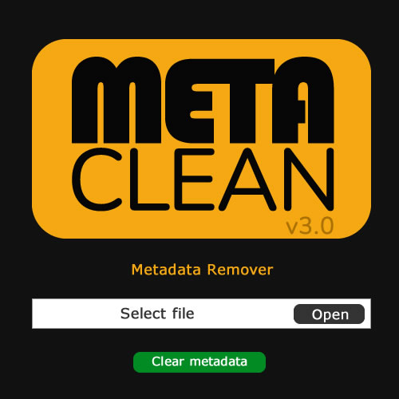

# 🪄 MetaClean – Metadata Cleaner (Images & Videos)

**MetaClean** is a simple Python application with a graphical interface (Tkinter) that removes **metadata** from **images** and **videos**.  
Useful for affiliates, social media, and anyone who wants to share files without embedded information.

---

## 📸 Screenshot

<div align="center">
  
</div>

---

## 📦 Prerequisites

- [Python 3.10+](https://www.python.org/downloads/)
- [pip](https://pip.pypa.io/en/stable/)

---

## ⚙️ Installation and development mode

Clone the repository and create a virtual environment:

```powershell
git clone https://github.com/seuuser/MetaClean.git
cd MetaClean

# create virtual environment
py -3 -m venv venv

# activate virtual environment
venv\Scripts\activate

# install dependencies
pip install --upgrade pip
pip install -r requirements.txt
```

Run the app:

```powershell
python main.py
```

---

## 🔽 Downloading FFmpeg

MetaClean depends on **ffmpeg.exe** to process videos.  
Since it's a large file, **we don't include it in the repository**.

### Step by step:

1. Visit: [https://www.gyan.dev/ffmpeg/builds/](https://www.gyan.dev/ffmpeg/builds/)
2. Download the latest **essentials build** version. Example used:
ffmpeg-2025-08-18-git-0226b6fb2c-essentials_build.7z

3. Extract the `.7z` file.
4. Inside the extracted folder, go to `bin/`.
5. Copy the `ffmpeg.exe` file.
6. Paste it inside the project's `ffmpeg/` folder:
MetaClean/ffmpeg/ffmpeg.exe

Done ✅ MetaClean will now find FFmpeg locally.

---

## 🛠️ Generate build (.exe)

Before generating a new build, **clean old folders**:

```powershell
rmdir /s /q dist build
del MetaClean.spec
```

Generate the executable with PyInstaller:

```powershell
pyinstaller --name "MetaClean" --onefile --noconsole ^
  --add-binary "ffmpeg/ffmpeg.exe;." ^
  --add-data "logo.png;." ^
  main.py
```

- The final executable will be located at:  
  ```
  dist\MetaClean.exe
  ```

---

## 🖼 Project structure

```
MetaClean/
│── main.py
│── requirements.txt
│── logo.png
│── .gitignore
│── ffmpeg/
│    └── ffmpeg.exe
```

---

## 🚀 Usage

1. Open `MetaClean.exe`.  
2. Select an image or video.  
3. Click **Clean metadata**.  
4. The cleaned file will be saved **in the same directory as the original**, renamed with a 6-character hash at the beginning:

```
a1b2c3_videooriginal.mp4
```

---

## 🕵️‍♂️ How to verify metadata

### Windows
- Right-click the file → **Properties** → **Details** tab.

### Video with FFmpeg
```powershell
ffmpeg -i arquivo.mp4
```

### Photo with ExifTool (optional)
```powershell
exiftool foto.jpg
```

---

## 👨‍💻 Developed by
**Diego Ribeiro**
